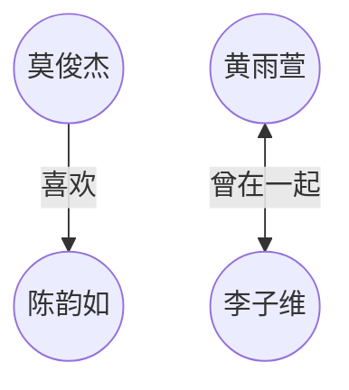

# 周一故事集

## 2023.01.06

镜子被打碎，落入凡间。

落入人眼则反目生嫌，落入人心亦相憎生厌。

某地有某情侣。男子的眼睛和心即被玻璃击中，当即对女子恶语相向。

后男子被抓至冰雪女皇的宫殿，用冰块拼“永恒”，不然不给走。

女子不计前嫌，前去营救，所赖上天荫庇，天使护佑，转危为安，营救成功。

女子眼泪融化了男子心中的玻璃，男子遂复归常人，相敬如宾如初。后两人在玩耍时恰把“永恒”拼出，遂重获自由。

后来啊，两人夫妻相对，恰似鸳鸯，双飞并膝，花颜共坐；两德之美，恩爱极重，二体一心。过上了幸福快乐的生活。

## 2023.01.08

偷莴苣被逮到。女巫说我同意，但是你小孩要交给我。女巫就把女孩子取名字为莴苣。

## 2023.01.11

|定位|姓名|性格|
|:---:|:---:|:---:|
|女主|黄雨萱|二十多岁，活泼开朗|
|男主|李子维|三十多岁了
|女主_image|陈韵如|三十多了，比较文静|
|男主_image|王诠胜|三十多岁了|
|男二|莫俊杰|
|不重要|杨浩||

女主做梦梦到和一个人听伍佰的歌。男主女主在奶茶店相遇。男主说女主长得像高中同学陈韵如，然后在一起了。

当年莫俊杰喜欢陈韵如，陈韵如喜欢李子维

