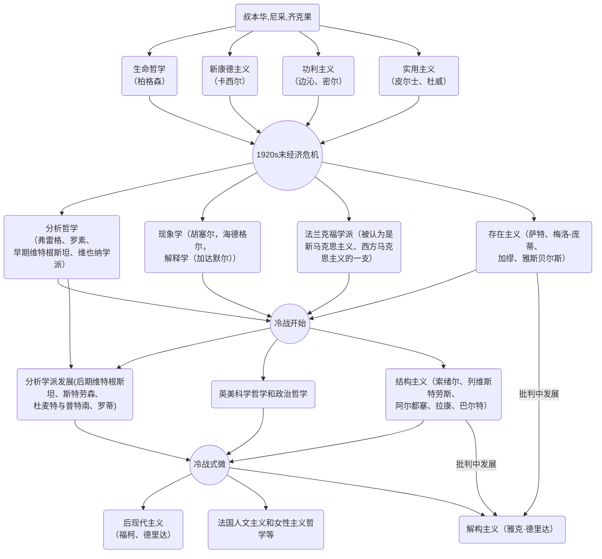

# 关于昨晚观点相悖的相关说明

## 综述

昨晚我们提到，在人本身的努力程度和道德品质相当的情况下，外部条件应当怎样影响他人对他的态度？我无意纠结对错，但希望通过更细致的研究，探究很多人、包括我们思路出现显著差异的原因。

首先我将介绍下我探究过程中涉及的基本事实和一些应当了解、得到认可的共识，并阐明自己昨晚实际表达的意思。随后将通过近现代哲学、传统价值观的塑造、生物学的筛选三方面来论述我昨晚认为自己会将外部条件来当作负面因素（后文将简称为“傲上而不忍下”）来对待的形成原因和渊源。近现代哲学的论述部分反应了本人的思想形成背景。

本文的意义在于探索这种不正确但颇有缘由的想法的来源，阐述这种想法的合理性以及相对不坏性，并防止姐姐认为我是恶心的坏人，而是人群里相对好的一类人。

## 事实、共识的声明

文中论述的观点，以及昨晚我表达的意思，是我认识中的**应然**，而不是实然。也就是我认为应当这样做，我理想中的更完美的自己会这样做，但在实际中我会妥协于更为普适的社会规训和道德要求，对所有人礼貌相待。我也并未基于我的“傲上而不忍下”观点，对任何“总裁”式人物进行实际上的损害（也就是说，我历史上对“总裁”式人物进行的损害，是基于其他普适的道德观念，无意细究）。就如同很多人认为应当平等相待，但实际上却做了“总裁”式人物的拥趸。

在讨论思想的来源时，道德说教并无太多意义。哲学不仅是形而上学，更能切实地反映社会思潮，归纳思想现象和文化模因（meme）。

我认为，世界上能够一碗水端平的人是极少数圣人。大部分人会认为人的外部条件是一个相处的因素。那么在事实上做不到圣人层次的情况下，探索一个属于自己的理论上能做到的区别对待的态度是一个无害的尝试。也就是说，圣人层次是一阶道理，但我认为一阶道理太过底层和正确而不想讨论。“傲上而不忍下”是我将要探究的二阶道理，但也仅仅是个道理，实际上我做到的，可能只是和大家一样而已。

## 不包括马哲的西方近现代哲学流派概述

黑格尔是古典哲学的集大成者。

黑格尔学派解体后，西方先后主要出现了如下近现代哲学流派（以其影响力扩大后为时间节点）：

其中，功利主义和实用主义是新古典主义的范畴。解构主义是现代哲学流派的重要一支，在20世纪后期得到广泛发展并在21世纪产生了重要影响。

解构主义、后现代主义都包含了对现代主义正统原则广泛的批判继承。

## 细谈部分西方近现代哲学流派

从自认为对我这类人思想影响较深的几个流派来看，其程度由重到轻分别为：

### 解构主义（Deconstructivism）

解构主义运用现代主义的语汇，却颠倒、重构各种既有语汇之间的关系，从逻辑上否定传统的基本原则，由此产生新的意义。用分解的观念，强调打碎，叠加，重组，重视个体，部件本身，反对总体统一而创造出支离破碎和不确定感。

19世纪末，尼采宣称“上帝死了”，并要求“重估一切价值”。他的叛逆思想从此对西方产生了深远影响。作为一股质疑理性、颠覆传统的思潮，尼采哲学成为解构主义的思想渊源之一。另外两股启迪和滋养了解构主义的重要思想运动，分别是海德格尔的现象学以及欧洲左派批判理论。1968年，一场激进学生运动席卷整个西方世界。在法国，抗议运动被称作“五月风暴”。虽然运动昙花一现，但在随之而来的郁闷年代里，激进学者难以压抑的革命激情却转向学术思想深层的拆解工作。他们明知传统、规则、秩序根深蒂固、难以摇撼，却偏要去破坏瓦解它所依赖的强大发达的各种基础，从它的语言、信仰、机构、制度，直到学术规范与权力网络。

解构主义在此背景下应运而生。为了反对形而上学、逻各斯中心，乃至一切封闭僵硬的体系，解构运动大力宣扬主体消散、意义延异、能指自由。换言之，它强调语言和思想的自由嬉戏，哪怕这种自由仅仅是一曲“带着镣铐的舞蹈”。除了它天生的叛逆品格，解构主义又是一种自相矛盾的理论。用德里达的话说，解构主义并非一种在场，而是一种迹踪。它难以限定，无形无踪，却又无时无处不在。换言之，解构主义一旦被定义，或被确定为是什么，它本身随之就会被解构掉。解构的两大基本特征分别是开放性和无终止性。解构一句话、一个命题、或一种传统信念，就是通过对其中修辞方法的分析，来破坏它所声称的哲学基础和它所依赖的等级对立。  

具体到对当代人们思潮的影像上，则很大程度上体现为怀疑一切、否定一切，对一切传统、规则、秩序所宣扬的神圣的观念加以戏谑、解构。解构主义不会把自己作为教条，而是当作一种反观传统和人类文明的意识。解构主义反对权威，反对对理性的崇拜，反对二元对抗的狭隘思维，**认为既然差异无处不在，就应该以多元的开放心态去容纳**。在对待传统的问题上，解构主义也并非像一些人认为的那样，是一种砸烂一切的学说。恰恰相反，解构主义相信传统是无法砸烂的，后人应该**不断地用新的眼光去解读传统**。而且，即使承认世界上没有真理，也并不妨碍每个人按照自己的阐释确定自己的理想。

换言之，解构主义敢于否定一切义务，也不要求一种新义务和新秩序。解构主义并不意味着排斥一切；相反的，它解构一切规则事务的同时，也意味着对所有行为进行了包容。

### 功利主义（Utilitarianism）

功利主义认为人应该做出能“达到最大善”行为，所谓最大善的计算则必须依靠此行为所涉及的每个个体之苦乐感觉的综合，其中每个个体都被视为具有相同分量，且快乐和痛苦是能够进行换算的，痛苦仅是“负的快乐”。不同于一般的伦理学说，功利主义不考虑一个人行为的动机与手段，仅考虑一个行为的结果对最大快乐值得影响。能增加最大快乐值得即使善；反之即为恶。边沁和米尔都认为：人类的行为完全以快乐和痛苦为动机。米尔还认为：人类行为的唯一目的是求得幸福，所以对幸福的促进就成为判断人一切行为的标准。

### 实用主义（Pragmatism）

>实用主义的特点在于它的真理论。它的真理论实际是一种不可知论。认识来源于经验，人们所能认识的，只限于经验，至于经验的背后还有什么东西，那是不可知的，也不必问这个问题。这个问题是没有意义的，因为无论怎么说，人们总是不能走出经验范围之外而有什么认识。要解决这个问题，还得靠经验。所谓真理，无非就是对于经验的一种解释，对于复杂的经验解释得通。如果解释得通，它就是真理，对于我们有用，即有用就是真理，忽略所谓客观的真理。
——冯友兰《三松堂自序》

实用主义把理论行动主义化和功利主义化：强调生活、行动和效果，经验和实在归结为行动的效果，知识归结为行动的工具，真理归结为有用、效用或行动的成功。

### 分析学派

暂略。

## 哲学产生影响的现实范例

### 解构主义

解构主义的影响相当广泛。以舆论风气为例，近年来对权威性的解构词汇大多都有解构主义的影响。

如对躺平的鼓吹，实际上就是对传统规则、秩序中“人应当努力奋斗”这一命题的彻底解构。解构者不会排斥解构自己的结构，如自尊、人格等。很多人自称“鼠鼠”，面对富裕地区的ip言论不讨论对错而一律报以“沪爷v50”、“京爷v50吃个肯德基”，将自己自贬至乞丐，而将传统的道德与自尊彻底解构。

解构主义否定一切的表现，在部分平台的言论中体现地很明显。比如知乎和贴吧用户会鲜明地将自身社区称呼为“男厕所”，用来表达这些自己正在用的平台往往是男性发布低素质言论的聚集地——当然，他们也会将微博、豆瓣、小红书称为“女厕所”、将b站称为“儿童厕所”、将抖音快手等称为“旱厕”、将虎扑强行拉入“男厕所”的行列。这一对自身的否定与解构只能在解构主义者身上看见。而其他受人文主义/女性主义或实用主义影响的群体则不会表达对自身的否定。比如微博的女拳大v虽然标榜“姐就是打女拳，打拳真的有用”，但她们断断不敢承认自身行为本身其实只是情绪的宣泄，她们依然在寻找着打拳行为的正当性——“追求女权，打倒男权社会”，虎扑、抖音等也会竭力证明自己男拳行为的正当性，而解构主义者却将这些别人认为的光荣、伟大的斗争行为都解构为**上厕所排泄**。

值得一提的是，很多自诩为“解构”主义者却热衷于建构别的事物，实际上是政治性较强的民族主义（Nationalism）或逆向民族主义者。如具体到中文互联网的解构主义者会一视同仁地解构男权与女拳、解构爱国主义与民族主义、解构自由平等民主等一切曾经被规训为“神圣”、“美好”的事物。而有的别有目的人将某些东西解构，实际上是为了建构自己所在意的其他事物。比如很多人解构爱国主义，只是为了表达对其他政治制度的赞美。也有人解构自由平等民主等观念，却是为了建构民族主义。

既然解构主义不在意解构自身，那么更不在意解构身外的结构。因此对于“人应当和谐相处”之类的规训，则自然处于解构、漠视、戏谑的位置了。

### 功利主义和实用主义

此种思潮对社会影响也很广泛而易于理解。比如流行的“文科生无用论”等等。

区别在于，对于电车难题，功利主义认为要增加总体的幸福，那么应当毫不犹豫舍弃一个人，救下一群人，这是一种崇高的使命。而实用主义则更关心自己会不会受到牵连，根据经验擅自改变电车运行路线会使自己牵扯上不必要的麻烦，还是什么都不做为妙。

但共同点在于，两种思潮都认为电车难题显然是有解的，功利主义依据人类总幸福量的计算，实用主义依据有效经验的判断，都能果断、坚持地对电车问题作答。

### 法国人文主义和女性主义

对我影响小，略

### 后现代主义

对我影响小，略。

## 中国古代传统价值观的影响

在中国古代传统价值观中，对于“傲上而不忍下”者并不会施加道德诘责，反而当作种种津津乐道的事迹。反抗上级、怒斥权威等尽管违背了等级制度，但在统治阶级内部的知识分子口中，依然具有某种令人敬佩的点。比如文人往往互相赞颂对政权、上位者的反抗——尽管这种反抗看来近似于抬杠，如明代言官的主动挨打、对“不为五斗米折腰”类似行为的歌颂。

从某些故事中，亦可管中窥豹。比如孙权求亲关羽一事：

>权遣使为子索羽女，羽骂辱其使，不许婚，权大怒。  
——《三国志》  
>
> 孙权用其谋，先送满宠回许都；却遣诸葛瑾为使，投荆州来。入城见云长礼毕。云长曰：“子瑜此来何意？”谨曰：“特来求结两家之好。吾主吴侯有一子，甚聪明。闻将军有一女，特来求亲。两家结好，并力破曹。此诚美事，请君侯思之。”云长勃然大怒曰：“吾虎女安肯嫁犬子乎！不看汝弟之面，立斩汝首！再休多言！”遂唤左右逐出。  
瑾抱头鼠窜，回见吴侯；不敢隐匿，遂以实告。权大怒曰：“何太无礼耶！”  
——《三国演义》第七十三回 玄德进位汉中王，云长攻拔襄阳郡

关羽是传统价值观中“义绝”的形象，“傲上而不忍下”原本就是形容关羽的。以其对待上级、尊者不加尊敬，而对下级（如廖化、周仓为“黄巾贼”出身，当时被主流社会鄙视，而关羽以礼相待，引以为重要僚佐）礼遇有加。

按传统道德观，孙权地位比关羽自己尊崇（吴侯为县侯，关羽仅为亭侯），能力亦可称英雄，与关羽并无明显优劣之分。权以尊位求亲，关羽理应以礼答复，甚至不应拒绝。按今天的观念，孙权公德私德无亏，以礼相待也应以礼答复。但是显然小说描写这一段关羽的无礼言行，并没有指责关羽的意思。毛宗岗父子批注、金圣叹批注也仅指出情节上为白衣渡江做伏笔，对关羽这种无礼言行反而略有慕羡、赞赏气概的意思，至少也是暧昧的唏嘘，全无指责之意。

这种与古今价值观完全违背的行为却并未招致指责，因为实际上，大多数人还是不傲上而忍下的。那么，人们就需要呼唤一种“矫枉过正”，去满足内心对“总裁式”人物的嫉妒和否定；也期望代表着“天之道，损有余而补不足”的天神（关帝爷），来帮助下位者夺走在人世间已经得到了太多的“总裁”式人物的一些尊严和幸福。从这个层次看，三国演义夸大地描写“吾虎女安肯嫁犬子乎”这种修辞丰富的辱骂句，恰是古代版爽文的模因。正是因为人们见的多了与关羽相反的对待“总裁”的人，故而格外崇拜有能力倒置尊卑者，并幻想自己也是这样有能力的人。

时至今日，以尊为卑、以卑为尊的朴素快感，加上对马克思主义的庸俗化解读“造反有理”，使得很多人的内心乐于看见对于上位者、强者的吃瘪。龙王赘婿等网文模板都契合该模因。

## 自然选择的影响

上古时代，显然对男性而言，倾向于对性吸引力强的同性进行打击的性状是有利的。另一方面，性吸引力强的男性可能会留下过多的后代而消解不对其进行打击的性状。在史前时代，对于男性而言，这种“嫉妒”情绪和相应的打击行为是一种非常有益的性状。

而女性的生育能力存在上限，往往不存在较强的竞争意识——再健壮智慧美丽的女子一辈子也只能生育有限个后代，而虚弱愚蠢丑陋的个体往往也能吸引到实力相近的异性而留下后代。女性中的“总裁”式人物不会对倾向于与其和平共处的其他女性造成自然选择压力。

## 结论

自然选择留下的嫉妒情绪，加以社会朴素的傲上快感，融合了现代解构主义等思潮的影响，我认为“傲上而不忍下”要鲜明地比给上位者做舔狗而排斥下位者要高尚——当然，由于解构主义思潮的影响，我很乐于解构“对所有人平等友好相待”的正确言论。不过摸着良心说，我认为前两种人差别对待者包括我自己都是答辩，当然我是更香的一坨。正确言论我只会虚弱地言语攻击，而很难发自内心去反对。
